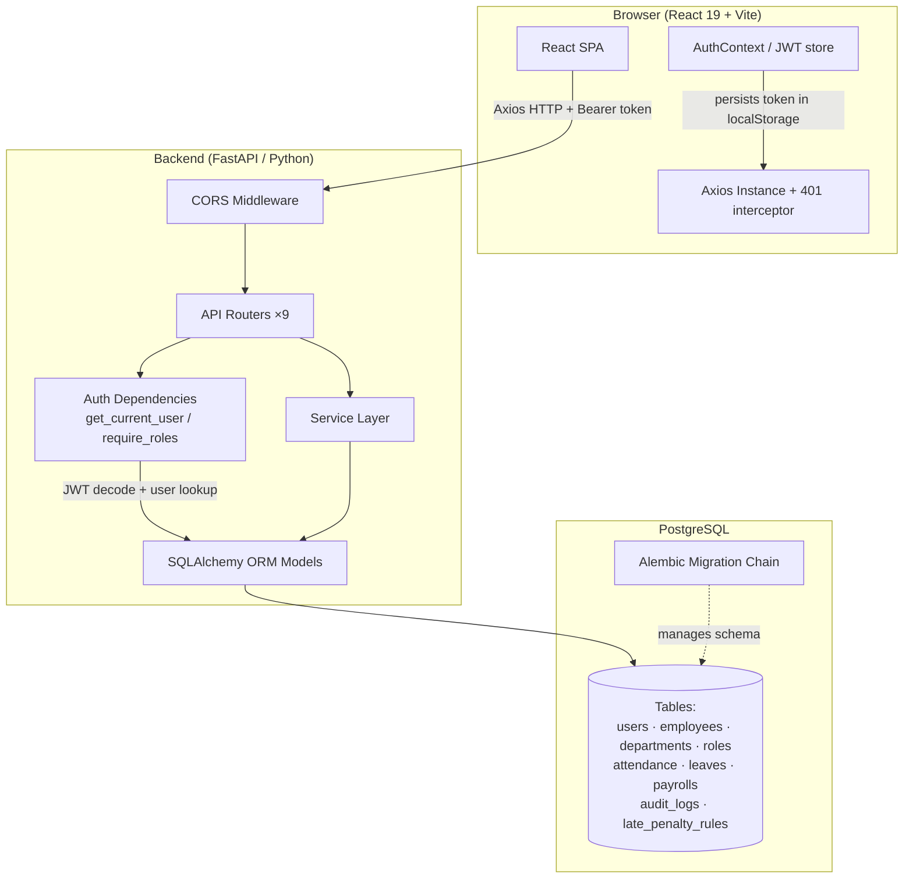
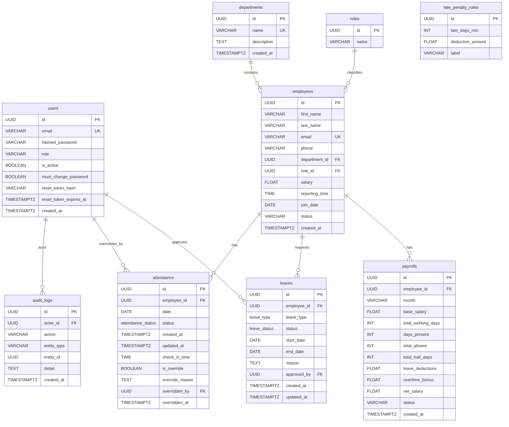
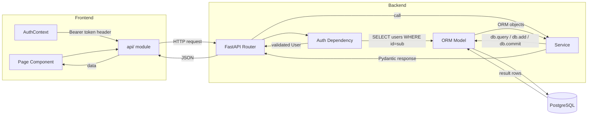
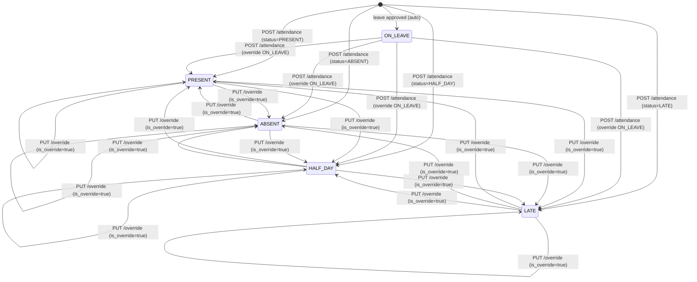
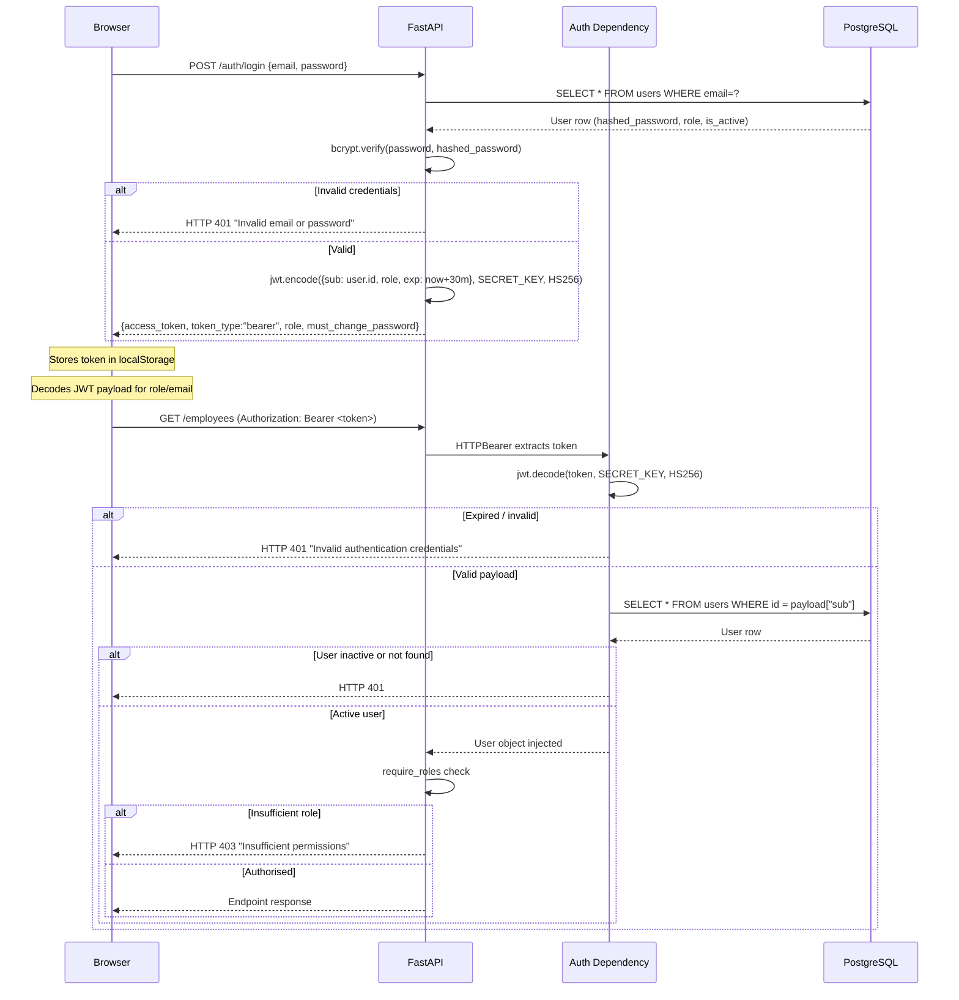
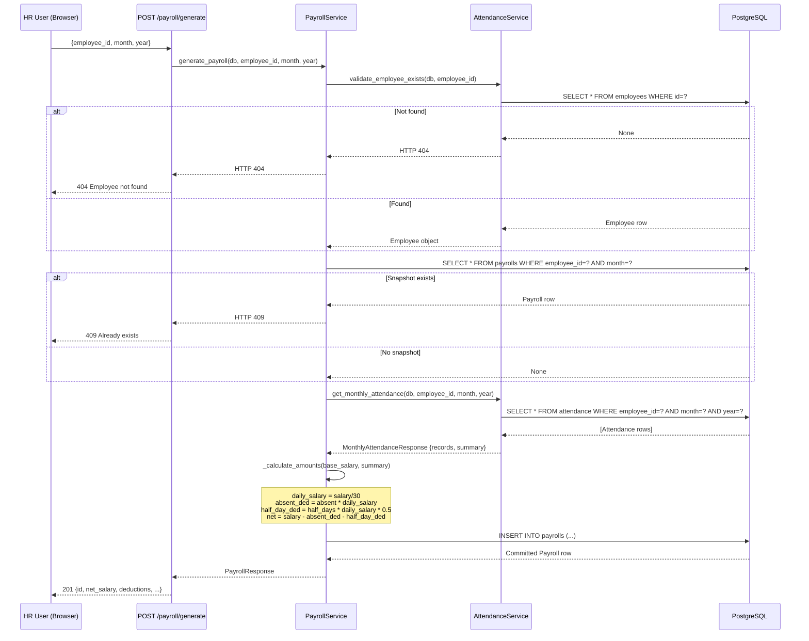
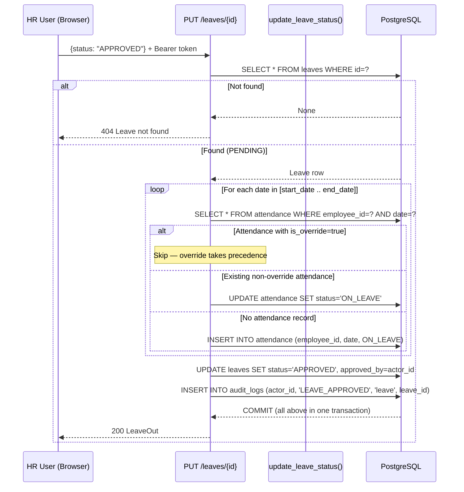

# Design Document: School Payroll Management System

## Overview

The School Payroll Management System is a full-stack web application that automates payroll processing for school institutions. It manages the complete employee lifecycle: department and employee master data, daily attendance tracking, leave request workflows, payroll snapshot generation, and audit logging — all behind a role-based JWT authentication layer.

The system is approximately 70% complete. The backend is built on FastAPI + SQLAlchemy 2.0 + PostgreSQL using a Service Layer pattern. The frontend is a React 19 SPA served by Vite with Tailwind CSS v4. The immediate delivery focus is Phase 1 stabilisation (startup-clean, schema-aligned, all routes importable), followed by Phase 2 late-coming policy and designations, and Phase 3 overtime, academic calendar, and payslip PDF generation.

---

## Architecture

See §1.1 below for the full architecture diagram and §1.5 for module interaction.

---

## Components and Interfaces

See §1.2 for the detailed component breakdown including Frontend, Backend Service Layer, and Database. Interface contracts are documented in §2.4.

---

## Data Models

See §1.3 for the complete Entity-Relationship Diagram. All ORM model definitions are in `backend/app/models/`. Key models: `User`, `Employee`, `Department`, `Attendance`, `Leave`, `Payroll`, `AuditLog`.

---

## Correctness Properties

### Property 1: Net Salary Formula Invariant

For every stored `payrolls` row, `net_salary = round(base_salary − (total_absent × (base_salary/30)) − (total_half_days × (base_salary/30) × 0.5), 2)`.

**Validates: Requirements 10.4, 10.5, 10.6, 10.7**

### Property 2: Daily Salary Precision

`daily_salary = round(base_salary / 30, 2)` for all Phase 1 payroll computations. This divisor is replaced by the count of `WORKING_DAY` entries in `academic_calendar` once Phase 3 is active.

**Validates: Requirements 10.4, 15.4, 15.5**

### Property 3: Attendance Override Completeness

For all `attendance` rows where `is_override = true`, `override_reason` is non-blank, `overridden_by` references a valid `users.id`, and `overridden_at` is a non-null UTC timestamp.

**Validates: Requirements 8.5, 8.6**

### Property 4: Leave Approval Coverage

When a leave transitions to `APPROVED`, exactly one `ON_LEAVE` attendance record exists per calendar date in `[start_date, end_date]` — except for dates where a pre-existing record has `is_override = true`, which are left unchanged.

**Validates: Requirements 8.10, 9.3**

### Property 5: Audit Log Atomicity

Every successful mutation of `attendance` (create, override) or `leave` (approve, reject) produces exactly one `audit_logs` row. If the containing transaction rolls back, no audit row is committed either.

**Validates: Requirements 11.1, 11.2, 11.3, 11.4, 11.5**

---

## Error Handling

See §Part 3 for the complete error-handling table mapping scenarios to HTTP status codes and handler locations.

---

## Testing Strategy

See §Part 4 for unit, property-based, integration, and frontend testing strategies.

---

## Part 1: High-Level Design

### 1.1 System Architecture Overview




The React SPA communicates exclusively through a versioned REST API. All state lives server-side. The frontend holds only the JWT access token (localStorage) and the decoded user profile. There is no real-time channel; pages poll or refetch on user action.


### 1.2 Component Breakdown

#### 1.2.1 Frontend (React 19 + Vite + Tailwind CSS v4)

| Layer | Responsibility |
|---|---|
| `AuthContext` | Stores JWT token and user profile in `localStorage`; exposes `login`, `logout`, `refreshProfile`; auto-logouts on token expiry via `setTimeout` |
| `ProtectedRoute` / `RoleRoute` | Guards every page; redirects unauthenticated users to `/login` and role-unauthorised users to `/403` |
| `MustChangePasswordGuard` | Intercepts navigation and forces `/change-password` when `must_change_password === true` |
| Pages (20 total) | Feature-scoped views: `Dashboard`, `Employees`, `Attendance`, `Payroll`, `Leaves`, `Reports`, `AuditLog`, plus employee-self-service pages (`MyAttendance`, `MyPayroll`, `MyLeaves`, `MyProfile`) |
| `SidebarLayout` | Shell navigation; sidebar links filtered by role |
| `api/` modules | Thin wrappers over the shared Axios instance; one module per backend domain (`auth`, `employees`, `attendance`, `payroll`, `leave`, `departments`, `users`, `audit`) |

#### 1.2.2 Backend (FastAPI)

| Layer | Files | Responsibility |
|---|---|---|
| **Entry point** | `app/main.py` | Assembles FastAPI app, registers CORS middleware, mounts all 9 routers, exposes `/health` probe |
| **Config** | `app/core/config.py` | Pydantic `Settings` loaded from `.env`; `SECRET_KEY` is required with no default |
| **Database** | `app/db/session.py` | SQLAlchemy engine (`pool_pre_ping=True`), `SessionLocal`, `Base`, `get_db` dependency |
| **Auth** | `app/auth/` | `jwt.py` — encode/decode HS256 tokens; `hashing.py` — bcrypt; `dependencies.py` — `get_current_user`, `require_roles`, `assert_employee_access`; `roles.py` — constants |
| **API Routers** | `app/api/` | 9 routers: `auth`, `users`, `departments`, `employees`, `attendance`, `payroll`, `leave`, `dashboard`, `audit_logs` |
| **Services** | `app/services/` | Business logic: `AuthService`, `AttendanceService`, `PayrollService`, `LeaveService` (functions), `DashboardService` |
| **ORM Models** | `app/models/` | `User`, `Employee`, `Department`, `Role`, `Attendance`, `Leave`, `Payroll`, `AuditLog` |
| **Schemas** | `app/schemas/` | Pydantic V2 request/response models with field validation |
| **Migrations** | `alembic/versions/` | 19 migration files; current head merges leave and attendance branches |

#### 1.2.3 Database (PostgreSQL)

All tables use UUID primary keys generated application-side (`uuid.uuid4()`). The engine is configured with `pool_pre_ping=True` to recover from dropped connections. Alembic manages all schema changes; the ORM never performs `CREATE TABLE` at runtime.

#### 1.2.4 Authentication & Authorisation

Three roles exist: `admin`, `hr`, and `employee`. Management operations (write attendance, generate payroll, approve leave) require `admin` or `hr`. Employee self-service routes (`GET /attendance/{id}`, `GET /payroll/{id}`, `GET /leaves/my`) are open to all authenticated users but enforce employee-ownership checks via `assert_employee_access`.


### 1.3 Database Entity-Relationship Diagram



Key constraints:
- `attendance(employee_id, date)` — unique constraint `uq_attendance_employee_date`
- `payrolls(employee_id, month)` — unique constraint `uq_payroll_employee_month`; `month` stored as `VARCHAR(7)` in `YYYY-MM` format
- `employees.email` — unique
- `users.email` — unique
- `audit_logs.actor_id` → `users.id` foreign key with B-tree indexes on `actor_id`, `action`, `entity_id`


### 1.4 API Layer Structure

All routes are prefixed and tagged. The table below maps each router to its mount prefix, HTTP methods, and required role.

| Router | Prefix | Key Endpoints | Min Role |
|---|---|---|---|
| `auth` | `/auth` | `POST /login`, `POST /register`, `GET /me`, `POST /forgot-password`, `POST /reset-password`, `POST /change-password` | public / authenticated |
| `users` | `/users` | `GET /`, `POST /`, `PUT /{id}`, `DELETE /{id}` | `admin` |
| `departments` | `/departments` | `GET /`, `POST /`, `PUT /{id}`, `DELETE /{id}` | `admin` / `hr` (read) |
| `employees` | `/employees` | `GET /`, `POST /`, `GET /{id}`, `PUT /{id}`, `DELETE /{id}` | `hr`/`admin` (write); self-read for `employee` |
| `attendance` | `/attendance` | `POST /`, `PUT /{id}/override`, `GET /{employee_id}` | `hr`/`admin` (write); self-read |
| `payroll` | `/payroll` | `POST /generate`, `PATCH /{id}/recalculate`, `GET /{id}` | `hr`/`admin` (write); self-read |
| `leave` | `/leaves` | `POST /`, `GET /my`, `GET /`, `PUT /{id}` | `employee` (create/view own); `hr`/`admin` (all/approve) |
| `dashboard` | `/dashboard` | `GET /admin`, `GET /hr`, `GET /employee`, `GET /reports` | role-specific |
| `audit_logs` | `/audit-logs` | `GET /` | `admin` only |

**Utility endpoints:**

- `GET /` — liveness check: `{"message": "School Payroll API is running"}`
- `GET /health` — readiness probe: `{"status": "ok"|"degraded", "database": "ok"|"error"}`
- `GET /docs` — OpenAPI UI (auto-generated by FastAPI)


### 1.5 Module Interaction Diagram



**Cross-cutting concerns:**

- **Audit writes** happen inside the same `db` session as the mutation. `AuditLog` rows are appended to the unit-of-work before `db.commit()` so they are atomic with the data change.
- **Error handling** uses FastAPI `HTTPException` raised inside services; the framework serialises these to JSON automatically.
- **DB session lifecycle** is managed by `get_db()` — a generator dependency that yields a `SessionLocal()` and closes it in the `finally` block, regardless of success or failure.
- **CORS** is configured via `settings.cors_origins_list`, which parses a comma-separated `CORS_ORIGINS` env var (default: `http://localhost:5173`).

---

## Part 2: Low-Level Design

### 2.1 Payroll Calculation Algorithm

The payroll engine is a pure computation pipeline. Given an employee and a target month/year, it reads attendance summary data, applies deduction formulas, and persists a snapshot.

#### 2.1.1 Step-by-Step Algorithm

```pascal
ALGORITHM generate_payroll(employee_id, month, year)
INPUT:  employee_id : UUID
        month       : INTEGER [1..12]
        year        : INTEGER [≥ 2000]
OUTPUT: PayrollSnapshot

BEGIN
  // Step 1: Validate employee
  employee ← db.query(Employee).filter(id = employee_id).first()
  IF employee IS NULL THEN
    RAISE HTTP_404 "Employee not found"
  END IF
  IF employee.salary IS NULL OR employee.salary ≤ 0 THEN
    RAISE HTTP_400 "Invalid employee salary"
  END IF

  // Step 2: Guard against duplicate snapshot
  month_key ← format("{year:04d}-{month:02d}")
  existing ← db.query(Payroll).filter(employee_id, month_key).first()
  IF existing IS NOT NULL THEN
    RAISE HTTP_409 "Payroll already exists for this employee and month"
  END IF

  // Step 3: Fetch attendance summary for the month
  records ← db.query(Attendance)
               .filter(employee_id, month, year)
               .all()
  summary.total_present   ← COUNT(r WHERE r.status = PRESENT)
  summary.total_absent    ← COUNT(r WHERE r.status = ABSENT)
  summary.total_half_days ← COUNT(r WHERE r.status = HALF_DAY)

  // Step 4: Compute monetary amounts
  daily_salary        ← ROUND(employee.salary / 30, 2)
  absent_deductions   ← ROUND(summary.total_absent * daily_salary, 2)
  half_day_deductions ← ROUND(summary.total_half_days * daily_salary * 0.5, 2)
  total_deductions    ← absent_deductions + half_day_deductions
  net_salary          ← ROUND(employee.salary - total_deductions, 2)

  // Step 5: Persist snapshot
  payroll ← Payroll(
    employee_id      = employee_id,
    month            = month_key,
    base_salary      = employee.salary,
    total_working_days = 30,
    days_present     = summary.total_present,
    total_absent     = summary.total_absent,
    total_half_days  = summary.total_half_days,
    leave_deductions = total_deductions,
    overtime_bonus   = 0,
    net_salary       = net_salary,
    status           = "generated"
  )
  db.add(payroll)
  db.commit()     // raises HTTP_409 on IntegrityError (race condition guard)

  RETURN PayrollResponse(payroll)
END
```


#### 2.1.2 Recalculation Algorithm

```pascal
ALGORITHM recalculate_payroll(employee_id, month, year)
INPUT:  employee_id, month, year
OUTPUT: updated PayrollSnapshot

BEGIN
  // Validate employee and salary (same as generate)
  employee ← validate_employee_exists(db, employee_id)

  // Must have existing snapshot
  payroll ← db.query(Payroll).filter(employee_id, month_key).first()
  IF payroll IS NULL THEN
    RAISE HTTP_404 "Payroll not found. Generate first."
  END IF

  // Re-read CURRENT attendance (reflects any overrides since generation)
  summary ← get_monthly_attendance(db, employee_id, month, year).summary
  amounts ← _calculate_amounts(employee.salary, summary)

  // Update snapshot in place
  payroll.days_present     ← summary.total_present
  payroll.total_absent     ← summary.total_absent
  payroll.total_half_days  ← summary.total_half_days
  payroll.leave_deductions ← amounts.total_deductions
  payroll.net_salary       ← amounts.net_salary
  payroll.status           ← "recalculated"
  db.commit()

  RETURN PayrollResponse(payroll)
END
```

**Postconditions for both algorithms:**
- `net_salary = base_salary − (total_absent × daily_salary) − (total_half_days × daily_salary × 0.5)`
- All monetary values rounded to 2 decimal places
- `daily_salary = base_salary / 30` (Phase 3 will replace `30` with academic calendar working days)


### 2.2 Attendance State Machine

Each `attendance` row has a `status` field constrained to an enum. The valid transitions are:



**State machine rules (enforced in `AttendanceService`):**

1. `POST /attendance` accepts `PRESENT`, `ABSENT`, `HALF_DAY`, `LATE` only. `ON_LEAVE` is rejected (`HTTP 422` via Pydantic schema; the `AttendanceCreate` schema does not include `ON_LEAVE` as an accepted input value).
2. If a record already exists with status `ON_LEAVE`, `POST /attendance` converts it to the new status (leave approval is overridden by an explicit HR mark).
3. If a record already exists with any other status, `POST /attendance` returns `HTTP 409`.
4. `PUT /attendance/{id}/override` accepts any status except `ON_LEAVE`. It sets `is_override=True`, records `override_reason`, `overridden_by`, and `overridden_at`.
5. Once `is_override=True`, leave approval (`PATCH /leave/{id}/approve`) will never touch that record — the override takes permanent precedence.


### 2.3 Late Penalty Computation Logic (Phase 2)

When attendance status is `LATE` and `check_in_time` is recorded, the payroll engine applies a tiered deduction based on the minutes late relative to the employee's `reporting_time`.

```pascal
ALGORITHM compute_late_deduction(check_in_time, reporting_time, daily_salary)
INPUT:  check_in_time  : TIME
        reporting_time : TIME (from employees.reporting_time, default 09:30)
        daily_salary   : FLOAT
OUTPUT: deduction      : FLOAT
        flag           : STRING  // "none" | "warning" | "half_day" | "full_day"

BEGIN
  IF check_in_time ≤ reporting_time THEN
    late_minutes ← 0
  ELSE
    late_minutes ← FLOOR((check_in_time - reporting_time) IN MINUTES)
  END IF

  IF late_minutes = 0 TO 10 (inclusive) THEN
    deduction ← 0.0
    flag      ← "none"

  ELSE IF late_minutes = 11 TO 30 (inclusive) THEN
    deduction ← 0.0
    flag      ← "warning"    // Warning flag stored on Payroll Snapshot; no monetary impact

  ELSE IF late_minutes = 31 TO 60 (inclusive) THEN
    deduction ← ROUND(daily_salary * 0.5, 2)
    flag      ← "half_day"

  ELSE IF late_minutes > 60 THEN
    deduction ← ROUND(daily_salary * 1.0, 2)
    flag      ← "full_day"

  END IF

  RETURN (deduction, flag)
END
```

**Integration with payroll generation (Phase 2 extension):**

```pascal
// Inside generate_payroll, after computing absent/half-day deductions:
late_records ← records WHERE status = LATE AND check_in_time IS NOT NULL
total_late_deductions ← 0.0
FOR EACH r IN late_records DO
  (ded, flag) ← compute_late_deduction(r.check_in_time, employee.reporting_time, daily_salary)
  total_late_deductions ← total_late_deductions + ded
END FOR

net_salary ← net_salary - total_late_deductions
payroll.late_deductions ← ROUND(total_late_deductions, 2)
```

The `late_penalty_rules` table provides configurable tier thresholds. For Phase 1 the tiers above are hard-coded constants; Phase 2 reads them from the database.


### 2.4 Key Service Function Signatures (Python)

#### `PayrollService` (`app/services/payroll_service.py`)

```python
class PayrollService:

    @staticmethod
    def _month_key(month: int, year: int) -> str:
        """Format month/year as YYYY-MM storage key."""

    @staticmethod
    def _parse_month_key(month_key: str) -> tuple[int, int]:
        """Parse YYYY-MM into (month, year) integers."""

    @staticmethod
    def _round_money(amount: float) -> float:
        """Round to 2 decimal places for all monetary fields."""

    @staticmethod
    def _normalize_attendance_summary(summary: Any) -> dict[str, int]:
        """Coerce dict-like or object-like summary into
        {"total_present": int, "total_absent": int, "total_half_days": int}.
        Returns all-zeros dict when summary is None."""

    @staticmethod
    def _calculate_amounts(
        base_salary: float,
        total_present: int,
        total_absent: int,
        total_half_days: int,
    ) -> dict[str, float | int]:
        """Pure computation. Returns:
        daily_salary, absent_deductions, half_day_deductions,
        total_deductions, net_salary (all rounded to 2dp)."""

    @staticmethod
    def generate_payroll(
        db: Session,
        employee_id: UUID,
        month: int,
        year: int,
    ) -> PayrollResponse:
        """Create a new Payroll snapshot. Raises:
        - HTTP 404 if employee not found
        - HTTP 400 if base_salary ≤ 0
        - HTTP 409 if snapshot already exists for (employee_id, month, year)"""

    @staticmethod
    def recalculate_payroll(
        db: Session,
        employee_id: UUID,
        month: int,
        year: int,
    ) -> PayrollResponse:
        """Recompute existing snapshot from current attendance. Raises:
        - HTTP 404 if employee not found OR snapshot does not exist
        - HTTP 400 if base_salary ≤ 0"""

    @staticmethod
    def get_payroll(
        db: Session,
        employee_id: UUID,
        month: int,
        year: int,
    ) -> PayrollResponse:
        """Fetch stored snapshot. Raises HTTP 404 if not found."""
```


#### `AttendanceService` (`app/services/attendance_service.py`)

```python
class AttendanceService:

    @staticmethod
    def validate_employee_exists(db: Session, employee_id: UUID) -> Employee:
        """Raises HTTP 404 if employee not found. Returns Employee."""

    @staticmethod
    def validate_date_not_future(attendance_date: date | datetime) -> date:
        """Raises HTTP 400 if date is after today (UTC). Returns normalised date."""

    @staticmethod
    def get_existing_attendance(
        db: Session,
        employee_id: UUID,
        attendance_date: date,
    ) -> Attendance | None:
        """Query for existing attendance record; returns None if absent."""

    @staticmethod
    def mark_attendance(
        db: Session,
        payload: AttendanceCreate,
        actor_id: UUID,
    ) -> Attendance:
        """Create or update attendance. Writes AuditLog in same transaction.
        Raises:
        - HTTP 400 — future date
        - HTTP 409 — record exists and status != ON_LEAVE
        Returns updated or new Attendance record."""

    @staticmethod
    def override_attendance(
        db: Session,
        attendance_id: UUID,
        new_status: AttendanceStatus,
        reason: str,
        overriding_user_id: UUID,
    ) -> Attendance:
        """Override status with audit trail. Sets is_override=True.
        Raises HTTP 404 if record not found."""

    @staticmethod
    def get_monthly_attendance(
        db: Session,
        employee_id: UUID,
        month: int,
        year: int,
    ) -> MonthlyAttendanceResponse:
        """Returns all records for the month plus summary counts."""
```

#### `leave_service` module (`app/services/leave_service.py`)

```python
def create_leave(db: Session, employee_id: UUID, data: LeaveCreate) -> Leave:
    """Persist PENDING leave. No business validations beyond schema."""

def get_employee_leaves(db: Session, employee_id: UUID) -> list[Leave]:
    """Return all leave records for one employee."""

def get_all_leaves(db: Session) -> list[Leave]:
    """Return all leave records (admin/HR view)."""

def update_leave_status(
    db: Session,
    leave_id: UUID,
    new_status: LeaveStatus,
    approved_by: UUID,
) -> Leave:
    """Approve or reject a leave request.
    On APPROVED: iterates leave date range, creates/updates attendance records
    to ON_LEAVE, skipping any record where is_override=True.
    Writes AuditLog (LEAVE_APPROVED or LEAVE_REJECTED) in same transaction.
    Raises HTTP 404 if leave not found."""
```

#### Auth dependencies (`app/auth/dependencies.py`)

```python
def get_current_user(
    credentials: HTTPAuthorizationCredentials = Depends(security),
    db: Session = Depends(get_db),
) -> User:
    """Decode Bearer JWT → validate sub UUID → query User → check is_active.
    Raises HTTP 401 on any failure."""

def require_roles(*allowed_roles: str) -> Callable[[User], User]:
    """Factory returning a dependency that calls get_current_user then
    checks user.role ∈ allowed_roles. Raises HTTP 403 if not."""

def assert_employee_access(db: Session, current_user: User, employee_id: UUID) -> None:
    """For management roles: no-op.
    For employee role: fetch linked Employee by email match and verify
    employee.id == employee_id. Raises HTTP 403 or HTTP 404."""
```


### 2.5 JWT Authentication Flow



**Token lifecycle (frontend):**

1. On login the `AuthContext` decodes the JWT client-side (`decodeToken`) to extract `email` and `role` immediately, then calls `GET /auth/me` to enrich with `employee_id`.
2. A `setTimeout` is set for `exp - Date.now()` milliseconds; when it fires, `logout()` clears localStorage and resets state.
3. The Axios instance emits a `window.dispatchEvent(new Event('auth:logout'))` custom event on any `HTTP 401` response, triggering centralised logout without a circular import from `AuthContext`.
4. On every route render, `isTokenExpired(token)` is checked; expired sessions redirect to `/login`.


### 2.6 Critical Data Flow: Payroll Generation




### 2.7 Critical Data Flow: Leave Approval



**Transaction atomicity:** All DB writes in leave approval — the status update, all attendance upserts, and the audit log — are committed in a single `db.commit()`. If any write fails, `db.rollback()` ensures no partial state is persisted.


---

## Part 3: Error Handling Strategy

| Scenario | HTTP Status | Handler Location |
|---|---|---|
| Employee not found | 404 | `AttendanceService.validate_employee_exists` |
| Future attendance date | 400 | `AttendanceService.validate_date_not_future` |
| Duplicate attendance (non-ON_LEAVE) | 409 | `AttendanceService.mark_attendance` |
| Payroll already exists | 409 | `PayrollService.generate_payroll` + `IntegrityError` guard |
| Payroll snapshot not found | 404 | `PayrollService.get_payroll` / `recalculate_payroll` |
| Negative/zero base salary | 400 | `PayrollService.generate_payroll` |
| Invalid JWT | 401 | `get_current_user` dependency |
| Expired JWT | 401 | `get_current_user` → `decode_access_token` |
| Insufficient role | 403 | `require_roles` dependency |
| Employee accessing another employee's data | 403 | `assert_employee_access` |
| Override to ON_LEAVE | 422 | Pydantic `AttendanceOverrideRequest.status_must_not_be_on_leave` validator |
| Leave not found | 404 | `update_leave_status` |
| DB commit failure | 500 | Service-level `except` + `db.rollback()` + `HTTPException(500)` |

---

## Part 4: Testing Strategy

### Unit Tests

Each `Service` method should be tested in isolation using a test database or mocked session. Key cases per service:

- `PayrollService._calculate_amounts`: property tests with arbitrary `base_salary`, `total_absent`, `total_half_days` — verify `net_salary ≥ 0` when deductions ≤ salary, and rounding invariants.
- `AttendanceService.mark_attendance`: test all four branches (new record, existing ON_LEAVE, existing other, future date).
- `update_leave_status`: test approve with mixed override/non-override attendance records.

### Property-Based Tests

Recommended library: `hypothesis` (Python).

```python
@given(
    base_salary=st.floats(min_value=0.01, max_value=1_000_000),
    total_absent=st.integers(min_value=0, max_value=30),
    total_half_days=st.integers(min_value=0, max_value=30),
)
def test_net_salary_non_negative(base_salary, total_absent, total_half_days):
    result = PayrollService._calculate_amounts(
        base_salary, 0, total_absent, total_half_days
    )
    assert result["net_salary"] >= 0

@given(...)
def test_daily_salary_two_decimal_places(base_salary, ...):
    result = PayrollService._calculate_amounts(base_salary, ...)
    assert result["daily_salary"] == round(result["daily_salary"], 2)
```

### Integration Tests

- Full `POST /auth/login → GET /employees → POST /attendance → POST /payroll/generate` flow with a real test database (pytest + SQLAlchemy + testcontainers or a dedicated test PostgreSQL).
- Leave approval atomicity: verify that if attendance insert fails mid-loop, neither the leave status nor the audit log is committed.

### Frontend Tests

- `AuthContext`: verify `isTokenExpired` correctly reads `exp` from decoded JWT; verify auto-logout fires on expired token.
- `RoleRoute`: verify redirect to `/403` for disallowed roles; verify `MustChangePasswordGuard` redirects to `/change-password`.

---

## Part 5: Future Phase Architecture Notes

### Phase 2: Late Coming Policy & Designations

- Add `late_penalty_rules` rows via `POST /late-penalty-rules` (admin only).
- Extend `Payroll` model with `late_deductions FLOAT NOT NULL DEFAULT 0`.
- Add `designations` table; add nullable `designation_id FK` to `employees`.
- `PayrollService.generate_payroll` reads penalty tiers from DB; falls back to Phase 1 hard-coded tiers when table is empty.

### Phase 3: Overtime, Academic Calendar, Payslip PDF

- `overtime_records` table: `POST /overtime` by HR; `PayrollService` sums `hours × daily_salary × rate_multiplier`.
- `academic_calendar` table: `WORKING_DAY` count replaces the hard-coded `30` divisor in `_calculate_amounts`.
- `GET /payroll/{employee_id}/payslip?month=M&year=Y`: generates PDF via `reportlab` or `weasyprint`; returns `Content-Type: application/pdf` with `Content-Disposition: attachment`.

All Phase 2 and Phase 3 additions use new Alembic migration files — no existing migrations are modified, ensuring the chain remains linear with a single head.
